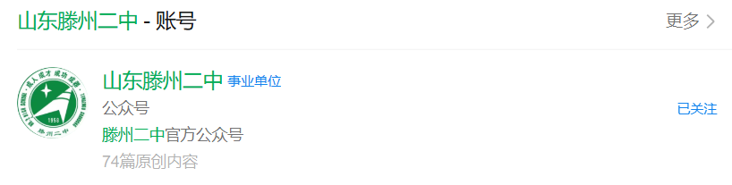

# **滕州二中通关指南**

***Make TZEZ Great Again!***

> **网站自带的搜索功能可以自动帮你查到已收录的老师！！！**

!> 手机端查看时，请点击**左下角**三条短横线或**右上角**的"目录"字样打开目录！

**阅读前须知：**

1. 本文是已经毕业的老登们为新加入及已加入二中大家庭的同学们编写，旨在将各位的经验薪火相传，助力未来每一届学弟学妹提升学习成绩与整体认知视野，仅供学习参考且完全免费。

2. 事实上，每一届同学都在重复同样的迷茫：大多数人在每个学习阶段，无论是对目标还是计划都不甚清晰，且每一届学生之间缺少实质性的反馈环节——学习方法好不好，只有自己亲身经历全程才能知晓，而过程中收获的经验教训、取得的成功，大多无法传递给下一届。于是下一届依旧以盲目、随机的状态备战高考，这也导致这几届的整体成绩，相较于二中的巅峰时期都不甚理想，这正是我们搭建这份文档的初衷。此外，也请各位学弟学妹以自身学业为重，本文内容仅作学习参考。

3. 在此，再次感谢共同参与编写该文档的各位同僚，我们都怀着对二中未来的共同期盼，愿这份心意能真正帮到每一位学弟学妹。

4. 文档保持开放，但为了防止全文删除等恶意事件，不再采用共享文档。对于来稿，我们将在确保合法合规、客观真实的前提下，将其纳入本文档中。目前，本文档所有区域都开放投稿，希望大家多多参与。

   **投稿方式：**

   1. 由二中万能墙代为转达：直接私信发送给万能墙即可，发送内容需包含署名（可非真名）、所投稿区域的大标题及大标题下的小标题。
   >滕州二中万能墙 <QQ: 3535766691>

   2. 直接发送至邮箱：将稿件发送至 [gscsdxy@proton.me](mailto:gscsdxy@proton.me) ，邮件标题需注明署名（可非真名）、所投稿区域的大标题及大标题下的小标题。
   

  **为避免重复和保证文档可读性，可能会将几篇来稿进行合成和语言润色，主编们也有自己的学业，更新时间不固定，请大家理解。**

5. 保持和谐的文档环境，不得出现人身攻击等不良行径

6. 欢迎同学们关注滕州二中微信公众号，以便及时得到更多官方消息通知。

### <h2>目录</h2>

[前言](/docs/前言.md)  

[一、学会学习，终身学习](/docs/一、学会学习，终身学习.md)  

[二、建筑篇](/docs/二、建筑篇.md)  
 
[三、作息篇](/docs/三、作息篇.md)  

[四、食堂及周边篇](/docs/四、食堂及周边篇.md)  

[五、宿舍篇](/docs/五、宿舍篇.md)  

[六、违禁品篇](/docs/六、违禁品篇.md)  

[七、常见问题篇](/docs/七、常见问题篇.md)  

[八、军训救命指南](/docs/八、军训救命指南.md)  

[九、学习经验](/docs/九、学习经验.md)  

[十、学会自我保护](/docs/十、学会自我保护.md)  

[十一、我对高考有话说](/docs/十一、我对高考有话说.md)  

[十二、其他](/docs/十二、其他.md)  

[后记](/docs/后记.md)  